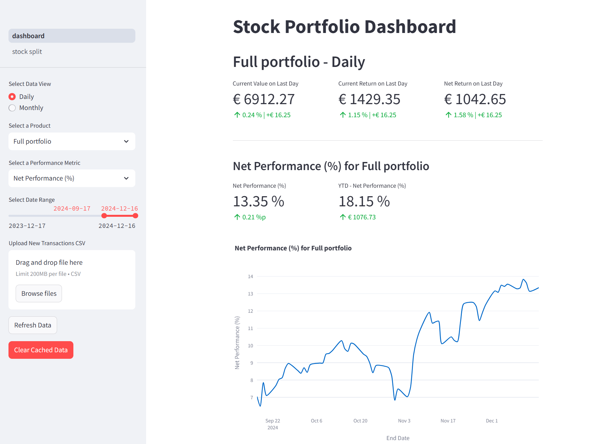

Streamlit dashboard displaying analytics of a DeGiro stock portfolio.



# Installation

## Docker
Before you start, make sure Docker is installed on your machine/server. See the [official Docker installation guide](https://docs.docker.com/engine/install/) based on your OS.

## Install app

### Create a new directory for your portfolio analyzer on your machine/server
```
mkdir portfolio-analyzer
cd portfolio-analyzer
```

### Download the docker-compose.yaml from GitHub
```
curl -O https://raw.githubusercontent.com/kbberendsen/portfolio-analyzer/main/docker-compose.yaml
```

### Create the .env file
Create a .env file in the same directory as the downloaded docker-compose file. If you want to use a Supabase database ([optional](#optional-supabase-database)), make sure to enter your URL and key values in the .env file and set `USE_SUPABASE` to `"true"`. If not, leave the default values.

```
cat <<EOT > .env
USE_SUPABASE=false
SUPABASE_URL=https://your-supabase-url
SUPABASE_KEY=your-supabase-api-key
EOT
```

### Build and run the Docker container

```
docker compose up --build -d
```

### Updating the container
```
docker compose down
docker compose pull
docker compose up --force-recreate -d --build
```

## Initial run

### Store Transactions.csv (from DeGiro) in uploads folder before opening the dashboard for the first time
- After building the container, an uploads folder will appear in the created directory (portfolio-analyzer).
- Before opening the dashboard/app for the first time, make sure to store a Transactions.csv in the uploads folder.
- This transactions file can be found in your DeGiro portfolio. Go to inbox > transactions and select the full date range of all transactions. then click export (csv).
- Put the csv file in the 'uploads' folder.
- Next time you want to update your transactions, the new transactions file can be uploaded through the dashboard. Putting the file in the uploads folder is only necessary before the first run.
- When updating the transactions file when you have new transactions, make sure to select the full date range of transactions each time to not miss any previous transactions.
\
\
So before opening the dashboard for the first time, your directory should look like this:

```
.
├── .env
├── cronjobs
│   └── logs
├── docker-compose.yaml
└── uploads
    └── Transactions.csv
```

### Open the app
Go to http://localhost:8501/ to see your stock portfolio dashboard! Loading the dashboard for the first time might take a few minutes, depending on the date range of transactions. Subsequent runs will take a few seconds to load.

## Optional: Supabase database
The app can utilize a [Supabase database](https://supabase.com/) to store and retrieve stock prices and portfolio performance data in the cloud. The Supabase free tier will suffice. Create a new project and create three tables (this can be done in the 'SQL Editor' in the Supabase online dashboard):

**Daily performance table**
```
CREATE TABLE portfolio_performance_daily (
    product VARCHAR,
    ticker VARCHAR,
    quantity INT,
    start_date DATE,
    end_date DATE,
    avg_cost NUMERIC,
    total_cost NUMERIC,
    current_value NUMERIC,
    current_money_weighted_return NUMERIC,
    realized_return NUMERIC,
    net_return NUMERIC,
    current_performance_percentage NUMERIC,
    net_performance_percentage NUMERIC,
    PRIMARY KEY (ticker, end_date)
);
```

**Monthly performance table**
```
CREATE TABLE portfolio_performance_monthly (
    product VARCHAR,
    ticker VARCHAR,
    quantity INT,
    start_date DATE,
    end_date DATE,
    avg_cost NUMERIC,
    total_cost NUMERIC,
    current_value NUMERIC,
    current_money_weighted_return NUMERIC,
    realized_return NUMERIC,
    net_return NUMERIC,
    current_performance_percentage NUMERIC,
    net_performance_percentage NUMERIC,
    PRIMARY KEY (ticker, end_date)
);
```

**Stock prices table**
```
CREATE TABLE stock_prices (
    ticker TEXT,
    date DATE,
    price NUMERIC,
    PRIMARY KEY (ticker, date)
);
```
After creating the tables, make sure to go to the Supabase project (API) settings to retrieve your __Supabase URL and key__. These values need to be filled in into the .env file created earlier.
